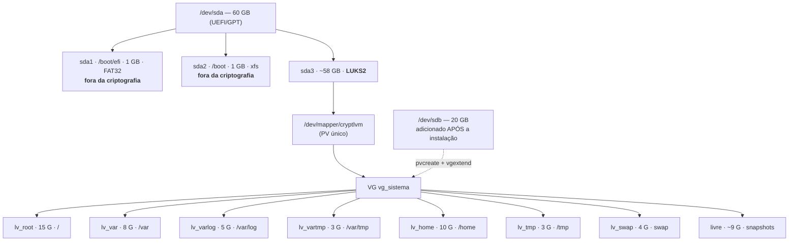

# Diagrama de particionamento — Grupo 2 · Rocky Linux

**Marco D-14 — submeter ao professor ANTES de instalar qualquer coisa.**

> "Corrigir um esquema no papel custa dez minutos; corrigir depois da instalação
> custa reinstalar."

---

## Diagrama



### Versão em texto

```
/dev/sda (60 GB, GPT, UEFI)
├── sda1  /boot/efi   1 GB   FAT32              fora da criptografia
├── sda2  /boot       1 GB   xfs                fora da criptografia
└── sda3  ~58 GB      LUKS2  container criptografado
        └── /dev/mapper/cryptlvm  (PV)
            └── VG vg_sistema
                ├── lv_root     15 G  /          xfs
                ├── lv_var       8 G  /var       xfs   nodev
                ├── lv_varlog    5 G  /var/log   xfs   nodev,nosuid,noexec
                ├── lv_vartmp    3 G  /var/tmp   xfs   nodev,nosuid,noexec
                ├── lv_home     10 G  /home      xfs   nodev,nosuid
                ├── lv_tmp       3 G  /tmp       xfs   nodev,nosuid,noexec
                ├── lv_swap      4 G  swap
                └── livre       ~9 G  reservado para snapshots

/dev/sdb (20 GB) — adicionado depois: pvcreate → vgextend → lvextend → xfs_growfs
```

---

## Justificativa de cada decisão

### Por que LVM **sobre** LUKS, e não o contrário

Um único container LUKS2 com o volume group inteiro dentro dele. Consequências:

- **Uma única passphrase no boot**, em vez de uma por volume.
- **Todo LV novo já nasce criptografado** — a criptografia é propriedade do PV,
  não de cada volume. Criar `lv_dados` amanhã não exige nenhuma etapa extra.
- O inverso (LUKS sobre LVM) exigiria um container por LV, uma passphrase por
  container e nenhuma herança automática.

### Por que `/boot` fica **fora** da criptografia

O GRUB precisa ler o kernel e o initramfs **antes** de existir qualquer chave
disponível — a chave só é derivada depois que o usuário digita a passphrase, e
isso acontece a partir do initramfs.

**Este é o risco residual do esquema, e o grupo tem que saber explicá-lo:** um
atacante com acesso físico ao disco pode alterar o kernel ou o initramfs em
`/boot` e implantar um capturador de passphrase (*evil maid attack*). A
criptografia protege os dados em repouso contra roubo e descarte de disco; não
protege contra adulteração do que fica fora do container.

Mitigações possíveis (candidatas ao bônus da rubrica): Secure Boot com kernel
assinado, boot criptografado com o GRUB abrindo o LUKS, ou selagem de chave no
TPM2 via Clevis/Tang.

### Por que espaço livre no VG é requisito, não sobra

Snapshot de LVM é copy-on-write: exige extents livres no volume group para
armazenar os blocos originais. Sem espaço livre:

- não há como tirar snapshot antes de uma atualização arriscada;
- não há como socorrer um volume que encheu, estendendo-o a quente.

**VG a 100% não é otimização, é problema.** Os ~9 GiB reservados existem para
essas duas operações.

### Por que partições separadas

| Volume | Motivo |
|---|---|
| `/var` | Serviço que gera dados sem limite não enche `/` e não derruba o sistema |
| `/var/log` | Log explodindo é o caso mais comum de disco cheio; isolá-lo preserva o boot |
| `/var/tmp` e `/tmp` | Áreas mundialmente graváveis, isoladas e montadas com `noexec` |
| `/home` | Dado de usuário separado do sistema; sobrevive a reinstalação |

### Opções de montagem — cada uma bloqueia um ataque

| Ponto | Opções | Ataque bloqueado |
|---|---|---|
| `/tmp`, `/var/tmp` | `nodev,nosuid,noexec` | Executar payload gravado em diretório mundialmente gravável — o vetor mais clássico de escalonamento de privilégio |
| `/home` | `nodev,nosuid` | Usuário comum criar um binário SUID dentro do próprio diretório |
| `/var/log` | `nodev,nosuid,noexec` | Proteger a integridade dos logs e impedir que a área de log vire ponto de *staging* |
| `/boot`, `/var` | `nodev` (+ `nosuid` no `/boot`) | Isolar crescimento de dados de serviço e proteger a área de boot |

O que cada opção faz:
- `nodev` — o kernel ignora arquivos de dispositivo no sistema de arquivos,
  impedindo criar um `/dev/sda` alternativo para ler o disco cru.
- `nosuid` — bits SUID/SGID são ignorados, anulando binários privilegiados
  plantados por usuário comum.
- `noexec` — nada é executado a partir dali (contornável por interpretador
  explícito, `bash arquivo`, mas eleva o custo e gera ruído).

---

## Conflitos previstos

> **A preencher com resultado de teste real — vale nota.**

| Conflito | Teste realizado | Decisão do grupo |
|---|---|---|
| `noexec` em `/var` quebra runtimes de container | _(…)_ | _(…)_ |
| `noexec` em `/var/tmp` pode quebrar `dnf` que descompacta ali | _(…)_ | _(…)_ |

---

## Aprovação

- [ ] Diagrama submetido ao professor em **__/__/____**
- [ ] Aprovado / ajustes solicitados: _(…)_
- [ ] Instalação iniciada somente após aprovação
